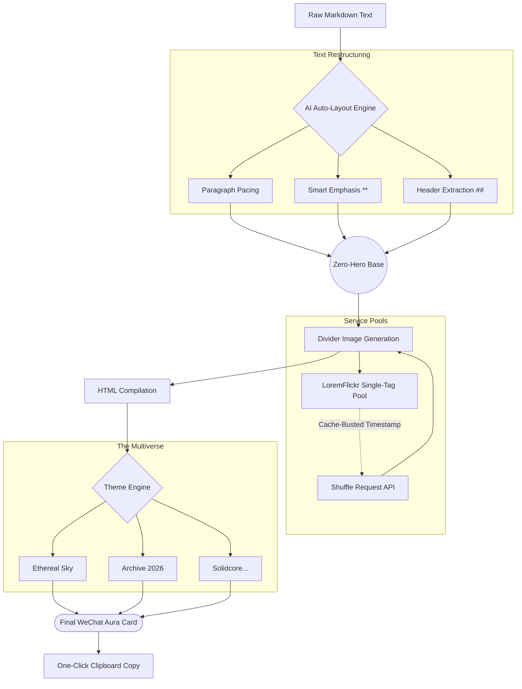
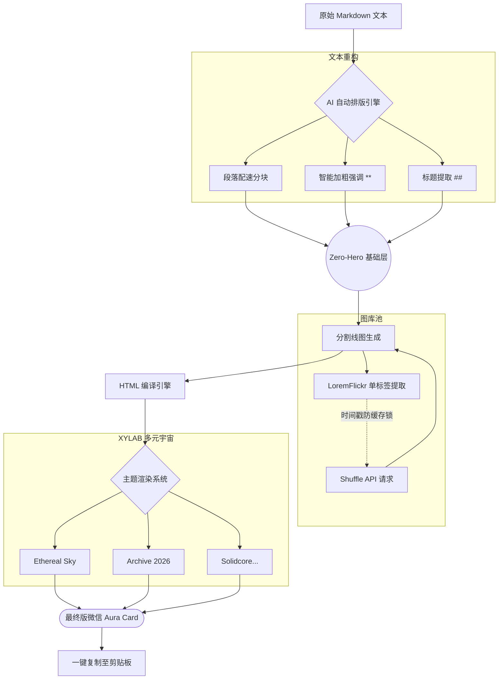

# XYLAB Smart Agent v4.1

[English](#english) | [中文](#中文)

---

## English

Welcome to **XYLAB Smart Agent**, an intelligent Markdown-to-HTML restructuring and layout tool designed for crafting pristine, highly-aesthetic article layouts (perfect for platforms like WeChat and Notion). 

Version 4.1 introduces the **Zero-Hero Policy**, 10 distinct Emotional Themes from the XYLAB Multiverse, and a robust stateless Shuffle Engine to guarantee massive visual variety. IT IS NOW DEPLOYED ON VERCEL.

### 🌐 Live Demo
You can access the live application at: **[https://ai-content-to-layout.vercel.app](https://ai-content-to-layout.vercel.app)**

### ✨ Features

- **Brain-Powered Auto-Layout**: The `smart_restructure` engine automatically parses raw text blocks. It provides "breathing room" by intelligently chunking long paragraphs, elevating short impactful phrases to HTML headers, and applying strategic bold emphasis (`**`) to the focal points of your sentences.
- **The XYLAB Multiverse (10 Themes)**: Render your text in 10 highly-stylized, CSS-injected aesthetic universes.
  - `Loopy Cute` (Pastel, bubbly, soft)
  - `Executive Gray` (Sharp grids, monochromatic)
  - `Ethereal Sky` (Airy, sky blue, dreamy)
  - `Techno Cyber` (Dark mode, neon cyan, circuit grids)
  - `Urban Pulse` (High contrast, skewed shadows, heavy pink/purple)
  - `Wonyoungism` (Glamorous, sparkly, rose gold)
  - `Algorithm Art` (Fluid mesh gradients, glassmorphism)
  - `Archive 2026` (Brutalist concrete, vintage fashion tape borders)
  - `Solidcore` (Kinetic motion blur, electric lime on dark charcoal)
  - `Bottari` (Organic paper textures, earthy minimalist gallery styles)
- **Zero-Hero Aesthetics**: Drops generic hero images entirely. The engine now goes straight into your typography, generating and isolating only *one* atmospheric mid-article Divider pulled dynamically from Flickr based on your active theme's keyword pool.
- **🎲 Stateless Shuffle**: Don't like the divider? Hit **Shuffle**. The app hits a dedicated API endpoint with timestamp cache-busting, retrieves a new image from the global Flickr pool, and safely replaces the markdown natively using localized Regex—without corrupting your current text edits.
- **One-Click Export**: Renders everything directly to an `id="aura-card"` container that you can copy to your clipboard in a single click, ready for pasting into any rich-text editor (like WeChat's Official Account portal).
- **📥 Extract Original Image**: Long-pressing images on mobile can be finicky. The new **Extract Image** button opens the raw image URL in a clean tab, making it effortless to save to your camera roll.

### 🧭 Workflow

### 🚀 Deployment & Local Run

**Deployment (Vercel)**
This project is optimized for **Vercel Serverless**. To deploy your own instance:
1. Fork this repository.
2. Link the repository to your Vercel Dashboard.
3. Vercel will automatically detect the `vercel.json` and `requirements.txt` to build your ASGI FastAPI instance.

**Run Locally**
Ensure you have Python 3.9+ installed. 

1. Create a Virtual Environment: `python3 -m venv venv` and `source venv/bin/activate`.
2. Install Dependencies: `pip install -r requirements.txt`.
3. Boot the Engine: `python main.py`.

### 🛠 Tech Stack
- **Backend**: Python, FastAPI, Uvicorn 
- **Processing**: BeautifulSoup4, Python-Markdown, native RegEx
- **Frontend**: HTML5, Tailwind CSS, Vanilla Javascript

---

## 中文

欢迎来到 **XYLAB Smart Agent（智能代理）**，这是一个智能的 Markdown 转 HTML 重排版工具，专为打造纯净、高美感的文章排版而设计（非常适合微信公众号和 Notion 等平台）。

4.1 版本引入了 **Zero-Hero（零头图）策略**、来自 XYLAB 多元宇宙的 10 种独立情感主题，以及强大的无状态 Shuffle 引擎。本项目现已成功部署于 Vercel。

### 🌐 线上演示
您可以访问以下地址体验：**[https://ai-content-to-layout.vercel.app](https://ai-content-to-layout.vercel.app)**

### ✨ 核心功能

- **AI 大脑自动排版**: `smart_restructure` 引擎会自动解析原始文本块。它通过智能分段长段落来提供“呼吸感”，将短促有力的短语提升为 HTML 标题，并对句子焦点进行战略性的加粗强调 (`**`)。
- **XYLAB 多元宇宙（10 大主题）**: 在 10 个高度风格化、CSS 注入的美学宇宙中渲染您的文本。
  - `Loopy Cute` (柔和、可爱、气泡感)
  - `Executive Gray` (锋利网格、单色调)
  - `Ethereal Sky` (空灵、天蓝色、梦幻)
  - `Techno Cyber` (深色模式、霓虹青色、电路网格)
  - `Urban Pulse` (高对比度、倾斜阴影、重粉/紫色调)
  - `Wonyoungism` (奢华、闪耀、玫瑰金)
  - `Algorithm Art` (流体网格渐变、玻璃拟物化)
  - `Archive 2026` (粗野主义混凝土、复古时尚胶带边框)
  - `Solidcore` (动感模糊、深空灰配荧光绿)
  - `Bottari` (原生纸张纹理、大地色极简画廊风)
- **Zero-Hero（零头图）美学**: 完全摒弃通用的图片头图。引擎现在直接切入排版，仅根据您激活主题的关键词池，从 Flickr 动态提取并孤立生成*唯一一张*充满氛围感的文中 Divider（分割图）。
- **🎲 无状态 Shuffle**: 不喜欢当前的图片？点击 **Shuffle（随机换图）**。应用会访问附加带有时间戳防缓存机制的独立 API 接口，从庞大的 Flickr 图库中检索新图片，并通过正则表达式安全地替换原 Markdown 中的链接。
- **一键导出**: 将所有内容直接渲染到 `id="aura-card"` 容器中，只需单击即可将其复制到剪贴板，随后可无缝粘贴至任何富文本编辑器（如微信公众号后台）。
- **📥 提取原图**: 针对移动端优化。点击 **提取原图** 按钮即可在新标签页中打开原始图片链接，方便长按保存至相册。

### 🧭 工作流

### 🚀 部署与本地运行

**线上部署 (Vercel)**
本项目针对 **Vercel Serverless** 进行了深度优化。如需部署您自己的版本：
1. Fork 本仓库。
2. 将仓库连接到您的 Vercel Dashboard。
3. Vercel 将自动检测 `vercel.json` 和 `requirements.txt` 来构建您的 ASGI FastAPI 实例。

**本地运行**
确保已安装 Python 3.9 或更高版本。

1. 创建虚拟环境：`python3 -m venv venv` 并激活 `source venv/bin/activate`。
2. 安装依赖包：`pip install -r requirements.txt`。
3. 启动引擎：`python main.py`。

### 🛠 技术栈
- **后端架构**: Python, FastAPI, Uvicorn 
- **数据处理**: BeautifulSoup4, Python-Markdown, 原生 RegEx 正则匹配
- **前端页面**: HTML5, Tailwind CSS, Vanilla Javascript

---
*由 XYLAB 驱动 // 2026*
